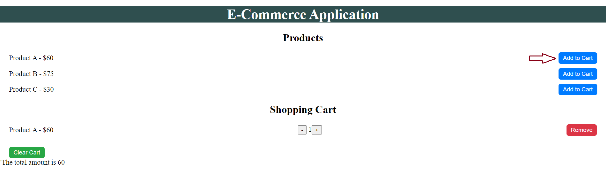
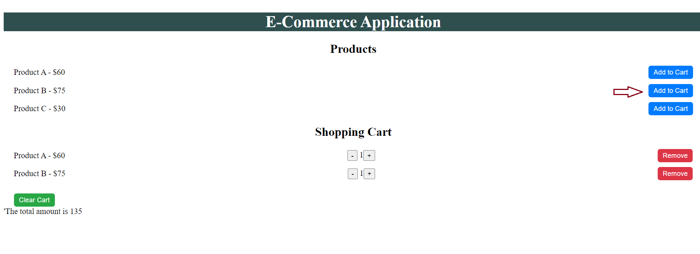
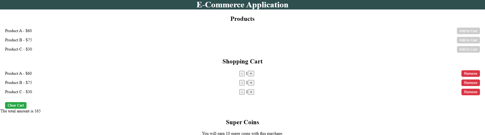

# E-Commerce App

## Overview
The **E-Commerce App** is a React application that demonstrates how to use Redux Toolkit for state management. It allows users to browse a list of products, add items to their cart, view cart contents, and remove items. It offers also super coins, which are a form of loyalty or reward points offered by some e-commerce platforms or retailers as part of their customer loyalty programs. The app provides a seamless user experience by managing state globally across all components.

## Features
- **Product List**: Displays a list of products with an "Add to Cart" button for each item.Please note that the Add to Cart button can be used only once to add a product. After this, it will be disabled and won't add the same product if you click on it again.
- **Cart Management**:
  - View items in the cart.
  - Remove individual items.
  - Clear the entire cart.
- **State Management**:
  - Built using Redux Toolkit to manage state globally.
  - `useDispatch` and `useSelector` hooks used for interaction with the Redux store.

## Implementation Details
- **React & Redux Integration**: 
  - The app is composed of multiple React components connected to a central Redux store.
- **Redux Toolkit**:
  - Simplifies state management and ensures scalability.
- **User Experience**:
  - Global state allows for seamless interaction between components without complex prop drilling.

## Screenshots




## Getting Started
To run the app locally:
1. Clone the repository.
2. Navigate to the project directory.
3. Install dependencies:
   ```bash
   npm install
   ```
4. Start the development server:
    ```bash
   npm start
   ```